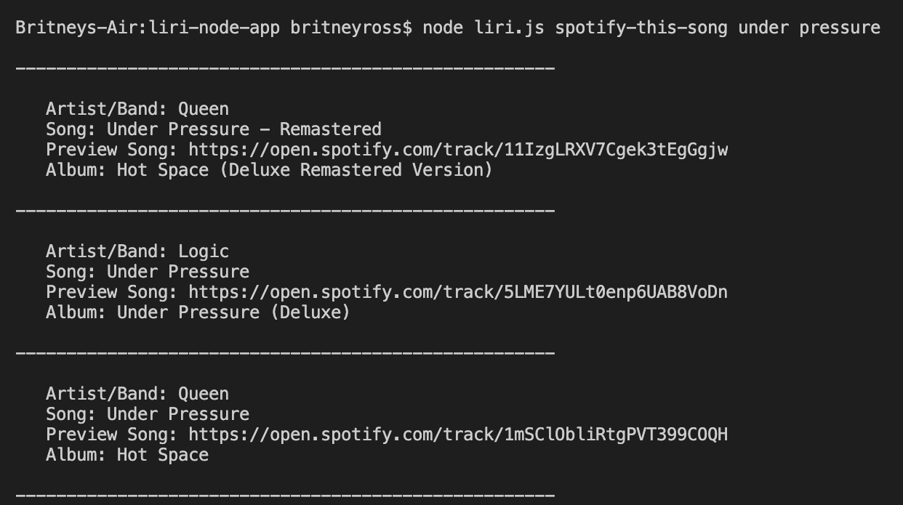
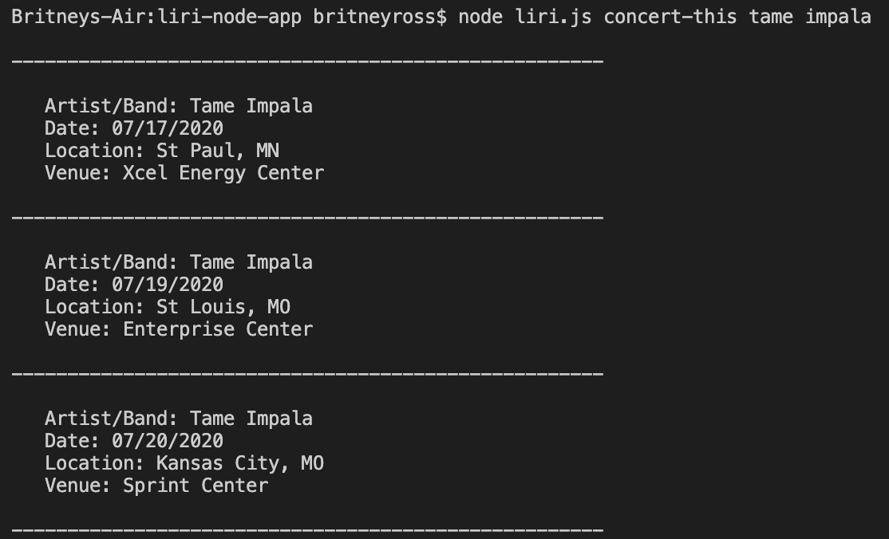
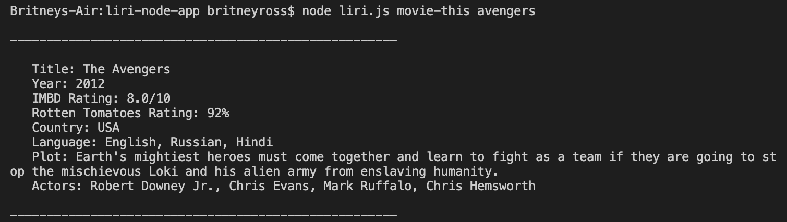

# LIRI Bot

## Function
LIRI is command line node app that takes in parameters and gives the user back data. LIRI will search Spotify for songs, Bands in Town for concerts, and OMDB for movies.

## Commands
* node liri.js spotify-this-song <song name here>
* node liri.js concert-this <artist/band name here>
* node liri.js movie-this <movie name here>

## Technologies Used
* Node-Spotify-API
* Axios
* Moment
* DotEnv 

